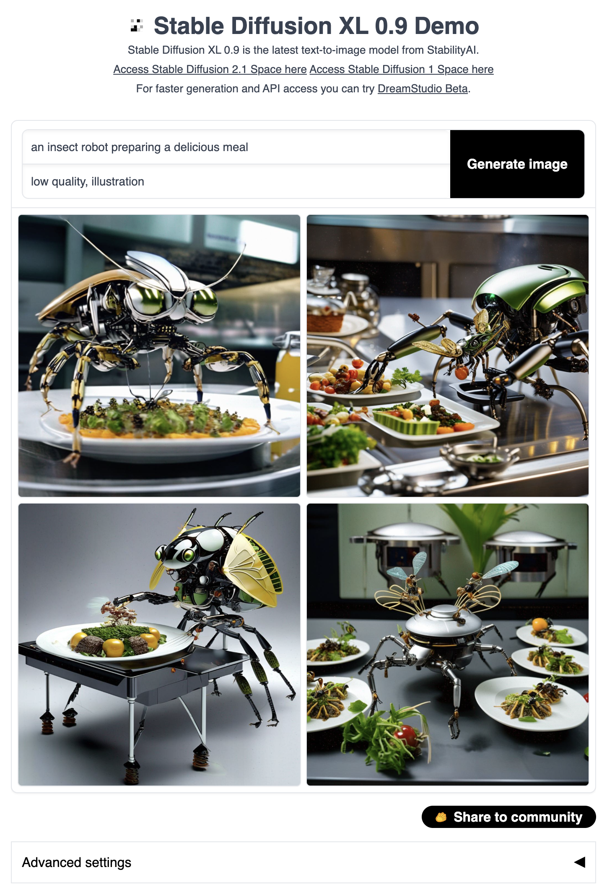
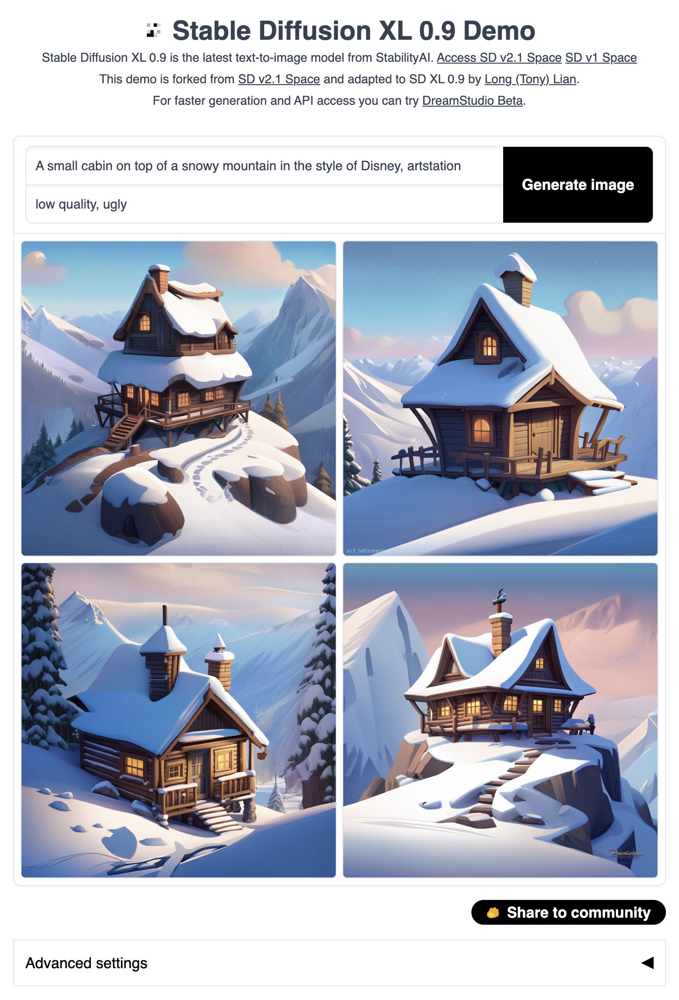

# StableDiffusion XL Gradio Demo
This is a gradio demo supporting [Stable Diffusion XL 0.9](https://github.com/Stability-AI/generative-models). This demo loads the base and the refiner model.

This is forked from [StableDiffusion v2.1 Demo](https://huggingface.co/spaces/gradio-client-demos/stable-diffusion). Refer to the git commits to see the changes.

## Examples
Left: SDXL 0.9. Right: [SD v2.1](https://huggingface.co/spaces/gradio-client-demos/stable-diffusion).

Without any tuning, SDXL generates much better images compared to SD v2.1!

### Example 1
<p align="middle">


</p>

### Example 2
<p align="middle">


</p>

### Example 3
<p align="middle">


</p>

### Example 4
<p align="middle">


</p>

### Example 5
<p align="middle">


</p>

## Installation
With torch 2.0.1 installed, we also need to install:
```shell
pip install accelerate transformers invisible-watermark "numpy>=1.17" "PyWavelets>=1.1.1" "opencv-python>=4.1.0.25" safetensors "gradio==3.11.0"
pip install git+https://github.com/huggingface/diffusers.git@sd_xl
```

## Launching
You need to [apply here](https://huggingface.co/stabilityai/stable-diffusion-xl-base-0.9) to get access to the weights.

There are two ways to load the weights. After getting access to weights, you can either clone them locally or this repo can load them for you.

### Option 1
If you have cloned both repo locally (please change the `path_to_sdxl`):
```
PYTORCH_CUDA_ALLOC_CONF=max_split_size_mb:512 SDXL_MODEL_DIR=/path_to_sdxl python app.py
```

### Option 2
If you want to load from the huggingface hub (please set up an [HuggingFace access token](https://huggingface.co/docs/hub/security-tokens)):
```
PYTORCH_CUDA_ALLOC_CONF=max_split_size_mb:512 ACCESS_TOKEN=YOUR_HF_ACCESS_TOKEN python app.py
```

### `torch.compile` support
Turn on `torch.compile` will make overall inference faster. However, this will add some overhead to the first run (i.e., have to wait for compilation during the first run).

### To save memory
1. Turn on `pipe.enable_model_cpu_offload()` and turn off `pipe.to("cuda")` in `app.py`.
2. Turn off refiner by setting `enable_refiner` to False.
3. More ways to [save memory and make things faster](https://huggingface.co/docs/diffusers/optimization/fp16).

## If you enjoy this demo, please give [this repo](https://github.com/TonyLianLong/stable-diffusion-xl-demo) a star ⭐.
I can also help generating a few images. Please create an issue for this.

If you have access to resources, please also help others with requests.

However, please abide by [the SD XL 0.9 license](https://huggingface.co/stabilityai/stable-diffusion-xl-base-0.9). **No commercial uses are permitted from these images.**


Feel free to also browse [my other projects](https://github.com/TonyLianLong).

