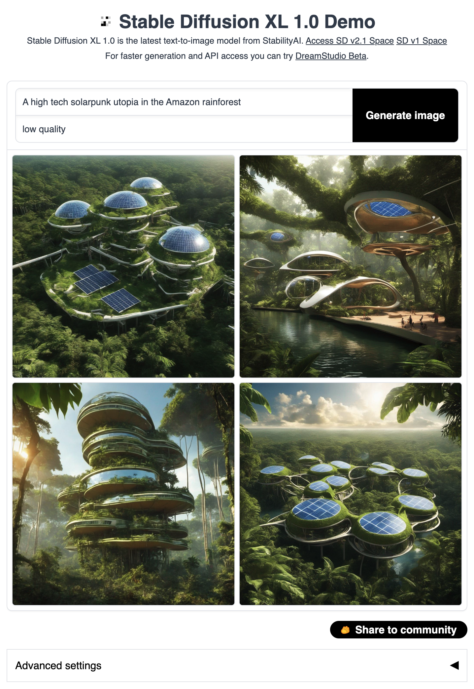
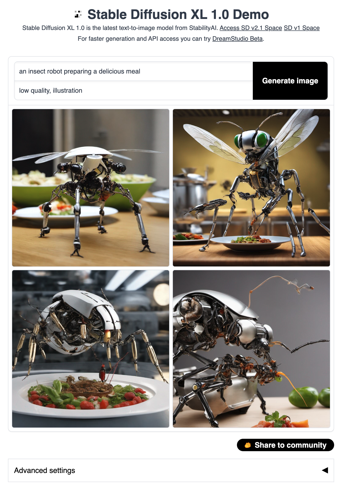
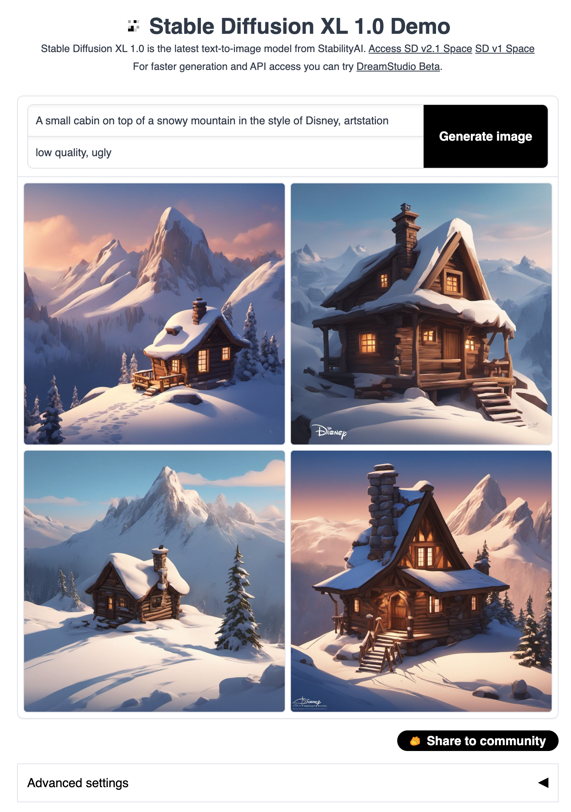
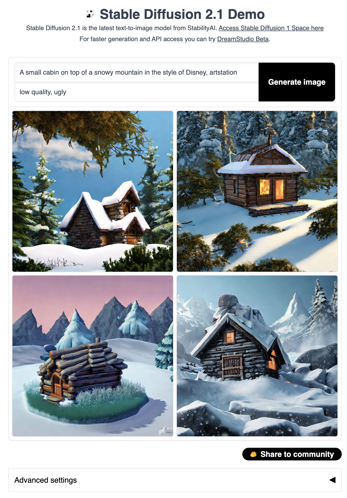

# StableDiffusion XL Gradio Demo WebUI
This is a gradio demo with web ui supporting [Stable Diffusion XL 1.0](https://github.com/Stability-AI/generative-models). This demo loads the base and the refiner model.

This is forked from [StableDiffusion v2.1 Demo WebUI](https://huggingface.co/spaces/gradio-client-demos/stable-diffusion). Refer to the git commits to see the changes.

**Update:** Check out our work <a href='https://llm-grounded-diffusion.github.io/'>**LLM-grounded Diffusion (LMD)**</a>, which introduces LLMs into the diffusion world and achieves much better prompt understanding compared to the standard Stable Diffusion without any fine-tuning! LMD with SDXL is supported on <a href='https://github.com/TonyLianLong/LLM-groundedDiffusion'>our Github repo</a> and <a href='https://huggingface.co/spaces/longlian/llm-grounded-diffusion'>a demo with SD is available</a>.

**Update:** [SDXL 1.0](https://huggingface.co/stabilityai/stable-diffusion-xl-base-1.0) is released and our Web UI demo supports it! No application is needed to get the weights! Launch the colab to get started. You can run this demo on Colab for free even on T4. <a target="_blank" href="https://colab.research.google.com/github/TonyLianLong/stable-diffusion-xl-demo/blob/main/Stable_Diffusion_XL_Demo.ipynb">
  
</a>

**Update:** Multiple GPUs are supported. You can easily spread the workload to different GPUs by setting `MULTI_GPU=True`. This uses data parallelism to split the workload to different GPUs.


## Examples

**Update:** [See a more comprehensive comparison with 1200+ images here](https://github.com/TonyLianLong/stable-diffusion-xl-demo/tree/benchmark/benchmark). Both SD XL and SD v2.1 are benchmarked on prompts from [StableStudio](https://github.com/Stability-AI/StableStudio).

Left: SDXL. Right: [SD v2.1](https://huggingface.co/spaces/gradio-client-demos/stable-diffusion).

Without any tuning, SDXL generates much better images compared to SD v2.1!

### Example 1
<p align="middle">


</p>

### Example 2
<p align="middle">


</p>

### Example 3
<p align="middle">


</p>

### Example 4
<p align="middle">


</p>

### Example 5
<p align="middle">


</p>

## Installation
With torch 2.0.1 installed, we also need to install:
```shell
pip install accelerate transformers invisible-watermark "numpy>=1.17" "PyWavelets>=1.1.1" "opencv-python>=4.1.0.25" safetensors "gradio==3.11.0"
pip install git+https://github.com/huggingface/diffusers.git
```

## Launching
It's free and *no form is needed* now. Leaked weights seem to be available on [reddit](https://www.reddit.com/r/StableDiffusion/comments/14s04t1/happy_sdxl_leak_day/), but I have not used/tested them.

There are two ways to load the weights. Option 1 works out of the box (no need for manual download). If you prefer loading from local repo, you can use Option 2.

### Option 1
Run the command to automatically set up the weights:
```
PYTORCH_CUDA_ALLOC_CONF=max_split_size_mb:512 python app.py
```

### Option 1
If you have cloned both repo ([base](https://huggingface.co/stabilityai/stable-diffusion-xl-base-1.0), [refiner](https://huggingface.co/stabilityai/stable-diffusion-xl-refiner-1.0)) locally (please change the `path_to_sdxl`):
```
PYTORCH_CUDA_ALLOC_CONF=max_split_size_mb:512 SDXL_MODEL_DIR=/path_to_sdxl python app.py
```

Note that `stable-diffusion-xl-base-1.0` and `stable-diffusion-xl-refiner-1.0` should be placed in a directory. The path of the directory should replace `/path_to_sdxl`.

### `torch.compile` support
Turn on `torch.compile` will make overall inference faster. However, this will add some overhead to the first run (i.e., have to wait for compilation during the first run).

### To save memory
1. Turn on `pipe.enable_model_cpu_offload()` and turn off `pipe.to("cuda")` in `app.py`.
2. Turn off refiner by setting `enable_refiner` to False.
3. More ways to [save memory and make things faster](https://huggingface.co/docs/diffusers/optimization/fp16).

### Several options through environment variables
* `SDXL_MODEL_DIR`: load SDXL locally.
* `ENABLE_REFINER=true/false` turn on/off the refiner ([refiner](https://huggingface.co/stabilityai/stable-diffusion-xl-refiner-1.0) refines the generation).
* `OFFLOAD_BASE` and `OFFLOAD_REFINER` can be set to true/false to enable/disable model offloading (model offloading saves memory at the cost of slowing down generation).
* `OUTPUT_IMAGES_BEFORE_REFINER=true/false` useful is refiner is enabled. Output images before and after the refiner stage.
* `SHARE=true/false` creates public link (useful for sharing and on colab)
* `MULTI_GPU=true/false` enables data parallelism on multi gpus.

## If you enjoy this demo, please give [this repo](https://github.com/TonyLianLong/stable-diffusion-xl-demo) a star ⭐.
